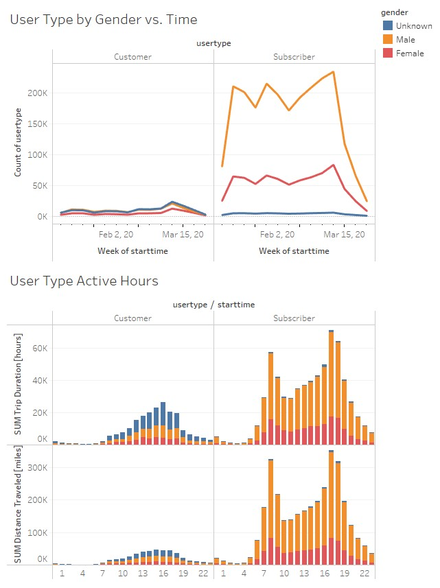
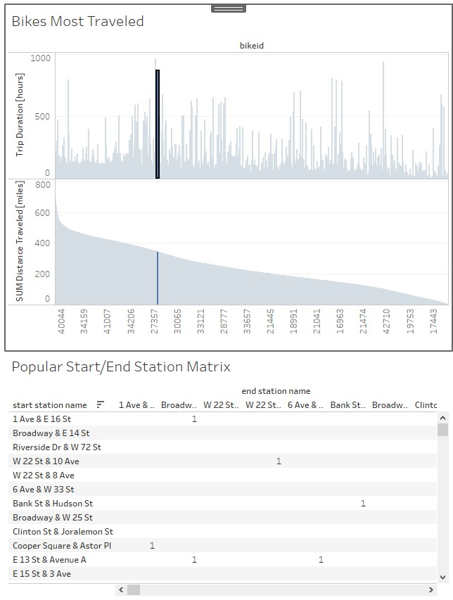
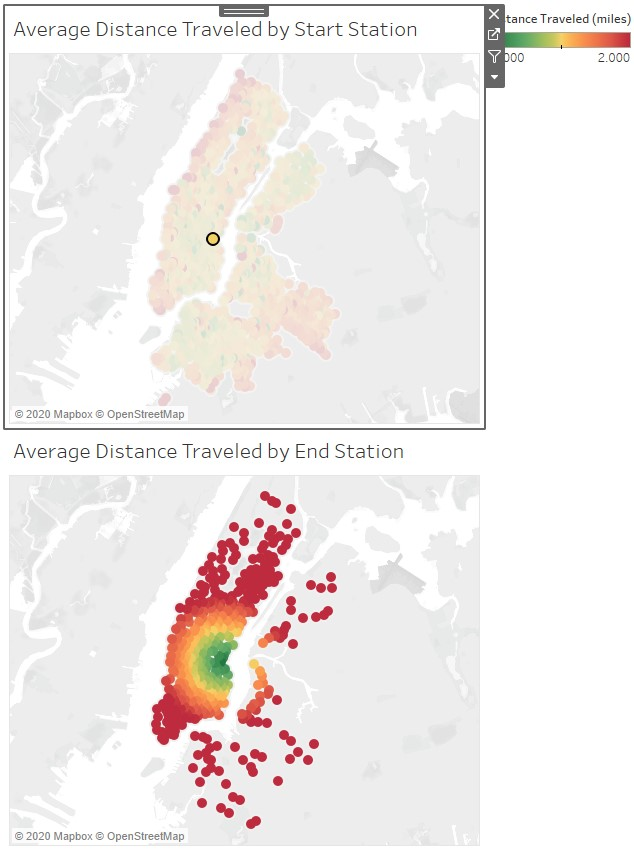

# Tableau Homework

The majority of the users are male. Subscribers use the bikes substantially more than customers. A large number of people canceled their subscription, possibly because of stay-at-home orders. Customers use the bikes throughout the day and mostly in the afternoon. Subscribers use their bikes mostly in the morning (i.e., commuting to work) and evening (i.e., commuting home).

  

Clicking on the bar graph or table allows the user to see which bikes are being used the most and at which stations. Note that trip duration on a particular bike does not necessarily correlate with total distance traveled. This may mean that some bikes are used on expressway-type roads while others are used in heavy stop-and-go areas.

  

City Official Map: Where are bikers travelling from and where are they traveling to? Clicking on the maps allows the user to visualize this.